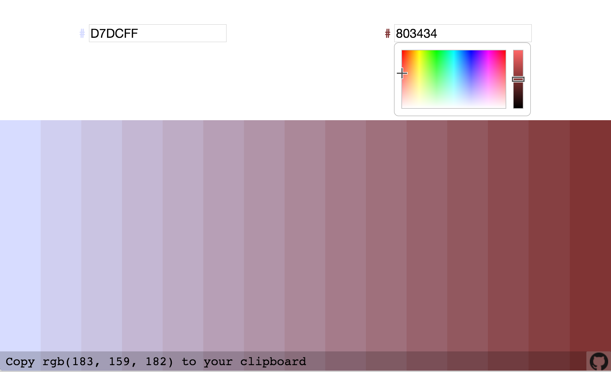

# Gradient Project #
was inspired by [uigradients](http://uigradients.com/), [Adobe Kuler](https://color.adobe.com/create/color-wheel/), and others. It is intended for designers and programmer who want more control over their color palettes.

### **use case** ###

Specifically, the Gradient Project is unique because it gives **discrete** color gradients (instead of continuous ones). This is helpful for finding the exact hue between two arbitrary colors or tinting colors in a precise direction.
